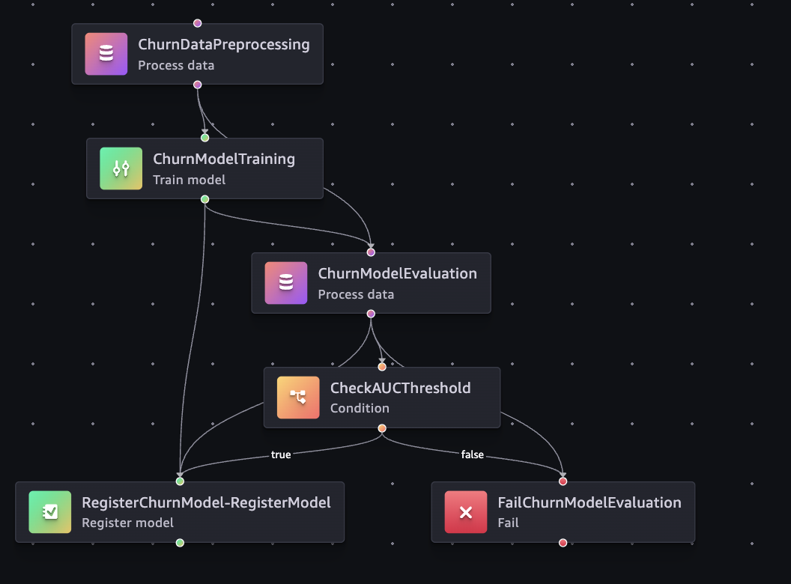

# Predicting SA Telco Churn with Eskom Load-Shedding Data

South African telco customers churn for reasons that go beyond the usual billing and contract factors. This project tests whether Eskom load-shedding exposure is a meaningful churn signal by joining daily shed-hour schedules per area to a telco churn dataset, then running the full training workflow through a SageMaker Pipeline managed with CDK.

The infrastructure lifecycle (pipeline registration, model registry setup and cleanup on destroy) is fully automated. 

---

## DAG structure



## What this does

The pipeline runs five steps in sequence:

1. **Preprocessing** — joins the churn dataset with a location-to-area-code map and an Eskom load-shedding schedule, encodes categoricals, scales numeric features and writes train/validation/test splits
2. **Training** — trains an XGBoost binary classifier using the SageMaker built-in container
3. **Evaluation** — scores the model on the test split and writes an `evaluation.json` report with AUC and accuracy
4. **Condition check** — registers the model in SageMaker Model Registry if AUC meets the threshold, otherwise fails the execution with the actual AUC in the error message

Infrastructure is managed with CDK across two top-level stacks: `StorageStack` (S3 buckets and data uploads) and `PipelineStack` (IAM roles, model registry, pipeline registration via CloudFormation custom resource).

---

## Results

The core question this project tests is whether Eskom load-shedding exposure adds predictive signal for SA telco churn, on top of the standard billing and contract features.

The XGBoost model was evaluated on the held-out test split and produced the following metrics:

| Metric | Value |
|---|---|
| AUC | 0.833 |
| Accuracy | 0.786 |

An AUC of 0.833 means the model can correctly rank a churner above a non-churner 83% of the time, which is a reasonable result for a churn model. The model cleared the 0.7 threshold and was registered in the SageMaker Model Registry with `PendingManualApproval` status.

The data is synthetic, so these numbers cannot be taken as evidence that load-shedding is a real churn driver. What the pipeline demonstrates is that once such a feature is available, built from actual Eskom schedules joined to a real subscriber base, the infrastructure is ready to test it at scale.

---

## Data architecture

This project follows a medallion lakehouse pattern where data moves through layers before reaching the ML pipeline.

In a production setup, raw source data (bronze) would be processed by an ETL job and land in the silver layer as cleansed, joined and lightly transformed datasets. The ML pipeline picks up from silver and does the ML-specific feature engineering from there.

The Hive-style partitioned silver bucket holds three synthetically generated files that represent what an ETL pipeline would have produced:

- `telco_churn_sa_loc.csv` — the core churn dataset, adapted from the [IBM Telco customer churn dataset on Kaggle](https://www.kaggle.com/datasets/yeanzc/telco-customer-churn-ibm-dataset/data). It uses a `location_id` column instead of a raw area code, meaning the ETL already resolved geographic identifiers to an internal key
- `location_area_map.csv` — a reference table mapping `location_id` to `area_code`, used by the preprocessing step to resolve the join
- `eskom_schedule_daily.csv` — load-shedding schedules aggregated to daily shed hours per area code, representing an external data source already cleaned and structured by an ETL job

The ML bucket receives the preprocessing scripts without a prefix. 

---

## Prerequisites

- [CDK environment](https://catalog.us-east-1.prod.workshops.aws/workshops/10141411-0192-4021-afa8-2436f3c66bd8/en-US/3000-python-workshop/200-create-project/210-cdk-init)
- CDK bootstrapped in your target account/region (`cdk bootstrap`)

```bash
pip install -r requirements_cdk.txt
```

---

## Deploy

```bash
cdk deploy --all
```

This deploys both stacks. To start an execution, trigger it from the SageMaker Studio console, the AWS CLI or run `python start_pipeline.py`.

---

## Destroy

Before running `cdk destroy`, you must manually [delete any registered model versions from the Model Registry](https://docs.aws.amazon.com/sagemaker/latest/dg/model-registry-delete-model-group.html). CloudFormation cannot delete a model package group that still contains versions, so the destroy will fail if you skip this step.


Then destroy the stacks:

```bash
cdk destroy --all
```

The SageMaker Pipeline is deleted automatically via the CloudFormation custom resource on destroy.

---

## Limitations

**No inference endpoint.** The pipeline ends at model registration. Deploying an endpoint is a separate step not covered here.

**Synthetic SA data.** The Eskom load-shedding and location datasets are constructed for this project and do not reflect real network or operational data.
